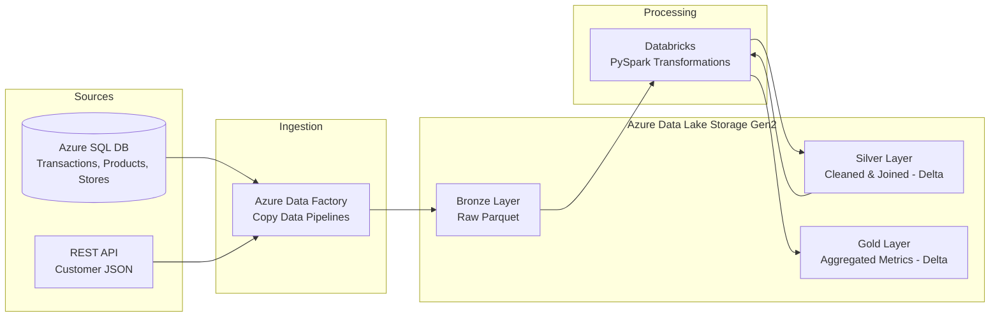

# Azure Retail Data Engineering Pipeline

An end-to-end Azure data engineering project built for a retail use case, implementing the **Medallion Architecture** (Bronze → Silver → Gold) to ingest, clean, and aggregate multi-source retail data for BI consumption.

## Business Requirements

- Build an end-to-end data pipeline for a retail client
- Ingest data from **multiple sources** into a centralized data lake
- Transaction, product, and store data available in **Azure SQL Database**
- Customer data available via a **REST API** in JSON format
- Deliver clean, business-ready data for reporting and visualization

## Architecture

## Tech Stack

| Layer | Tool |
|---|---|
| Source | Azure SQL Database, REST API |
| Orchestration / Ingestion | Azure Data Factory |
| Storage | Azure Data Lake Storage Gen2 |
| Transformation | Azure Databricks (PySpark, Delta Lake) |

## Pipeline Flow

1. **Ingestion (ADF):** Four parallel Copy Data activities pull `transactions`, `products`, and `stores` from Azure SQL DB, and `customers` from a REST API, landing all four as Parquet files in the **Bronze** layer of ADLS Gen2.
2. **Bronze → Silver (Databricks):**
   - Read raw Bronze Parquet files into Spark DataFrames
   - Cast columns to correct data types
   - Remove duplicate customer records
   - Join transactions with customers, products, and stores
   - Calculate `total_amount` (quantity × price)
   - Write the unified, cleaned dataset to **Silver** as Delta format
3. **Silver → Gold (Databricks):**
   - Aggregate the Silver dataset by transaction date, product, and store
   - Compute business metrics: total quantity sold, total sales amount, number of transactions, average transaction value
   - Write the result to **Gold** as Delta format
## Data Model

**Source tables:**
- `products` — product_id, product_name, category, price
- `stores` — store_id, store_name, location
- `transactions` — transaction_id, customer_id, product_id, store_id, quantity, transaction_date
- `customers` (API/JSON) — customer_id, first_name, last_name, email, city, registration_date

**Gold layer output:**
- transaction_date, product_id, product_name, category, store_id, store_name, location
- total_quantity_sold, total_sales_amount, number_of_transactions, average_transaction_value

## Notes

- Built and tested using a sample/dummy retail dataset on Azure for Students subscription; the pipeline pattern (multi-source ingestion → medallion layers → BI) scales the same way to production volumes with partitioning and incremental loads.
- Databricks transformations were run on Databricks Free Edition using serverless compute with direct `abfss://` storage access (in place of the deprecated `dbutils.fs.mount` approach).